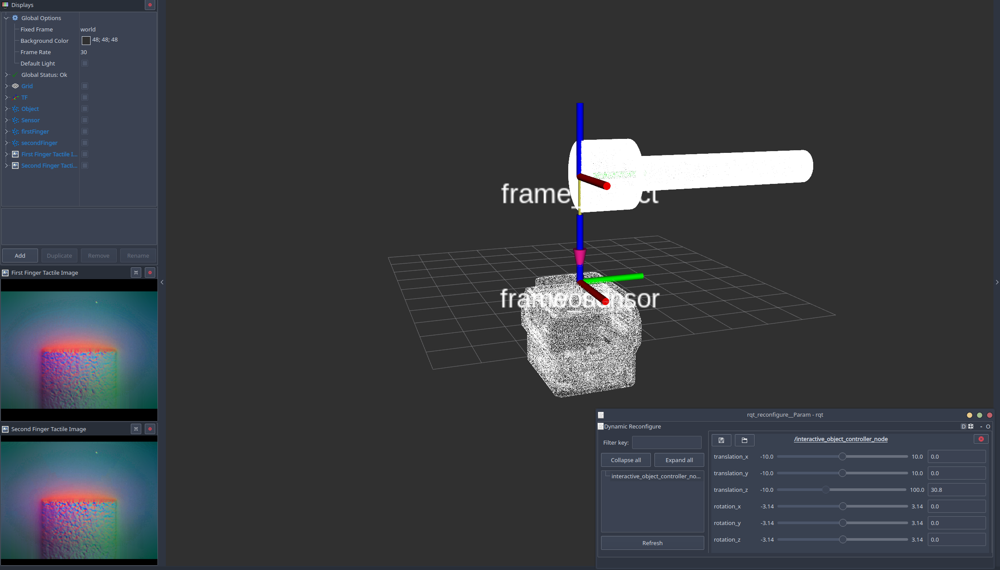
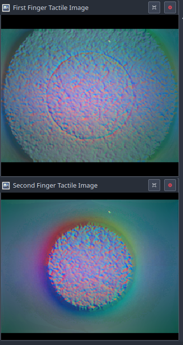

# gelsightmini_ros_bundle
Repository containing ROS packages for interfacing with the Gelsight Mini tactile sensor, enabling integration into robotic systems and applications.

## Overview
This repository contains all the necessary ROS packages and dependencies to interface with the Gelsight Mini tactile sensor. It allows for reading images from both a physical sensor and a simulator, and utilizes the Gelsight SDK with its neural network to convert images into point clouds.

## Included Packages
- **Gelsight SDK**: Forked and modified version of the Gelsight SDK for processing tactile images.
  - [Gelsight SDK Repository](https://github.com/YourUsername/Gelsight-SDK)
- **Taxim**: Forked and modified version of the Taxim simulator for generating synthetic tactile data.
  - [Taxim Repository](https://github.com/YourUsername/Taxim)

> Note: The packages required for the project will be automatically installed following the steps outlined in the Setting up your environment section. Direct modifications or pushes to packages other than gelsightmini_ros_bundle should be avoided.

## Environment Structure
The repository is organized into the following main directories:

- `rosinstall`: Contains ROS installation files.
- `Gelsight-SDK`: Contains the Gelsight SDK for image processing used with real sensor and simulated one.
- `Taxim`: Contains the Taxim simulator for generating synthetic tactile data.
- `gelsightmini_ros_bundle`: The main ROS package for interfacing with the Gelsight Mini sensor serves both to simulate tactile images intuitively and to use the real sensor more effectively, extracting fundamental data.

### Detailed Structure
Here is the detailed structure of the repository:
```
gelsightmini_ros_bundle/
│
├── gelsightmini_venv/           # Virtual environment for dependencies
│
├── gelsightmini_to_pc/          # Code to convert real Gelsight images to point clouds
│
├── data_folder/                 # Contains data used for simulation and processing
│
├── simulated_gmini_to_pc/       # Contains packages for simulating tactile images
│
├── gelsightmini_ros_bundle.repos # File specifying ROS repositories
├── requirements.txt             # Python dependencies
├── README.md                    # This README file
```

## Setting up Your Environment

Create a ROS workspace (if you already have one, you can skip this step):
```bash
mkdir -p ~/gsmini_ws/src
cd ~/gsmini_ws
catkin init
```

Then:
```bash
cd ~/gsmini_ws/src
git clone https://github.com/FabPrez/gelsightmini_ros_bundle.git
mkdir rosinstall
cp gelsightmini_ros_bundle/gelsightmini_ros_bundle.repos rosinstall/gelsightmini_ros_bundle.repos 
vcs import < rosinstall/gelsightmini_ros_bundle.repos
cd ..
vcs pull src
sudo apt update && sudo apt upgrade -y
rosdep install --from-paths src --ignore-src -r -y
catkin config -j $(nproc --ignore=2)
catkin build -cs --mem-limit 50%
source devel/setup.bash
```
Create the virtual environment and install the requirements:
```bash
cd src/gelsightmini_ros_bundle/
python3 -m venv gsmini_venv
source gsmini_venv/bin/activate
cd gelsightmini_ros_bundle/
pip install -r requirements.txt
```
### Other dependecies
```bash
sudo apt-get install ros-noetic-cv-bridge
```
---

## Usage
### Simulated_gmini_to_pc
This ROS interface for Taxim allows for obtaining tactile images from a PLY object file positioned in the `data_folder` directory. Specify the object name when launching the package with `obj_name`:

1. **Single Contact Simulation:**
   ```sh
   roslaunch tactile_image_simulator singleContact_tactile_simulator.launch obj_name:=Simple_Pin
   ```

2. **Parallel Gripper Simulation:**
   ```sh
   roslaunch tactile_image_simulator parallelGripper_tactile_simulator.launch obj_name:=Simple_Pin
   ```

These commands will simulate a single or dual contact, respectively. Note that the second sensor in the dual contact simulation is not visualized in RViz.



#### Moving the Object
To move the object, use the dynamic reconfigure interface as shown in the provided screenshot. This interface allows you to adjust the position and orientation of the sensor and the object.

#### Output data
The tactile images are published on the following topics:
- `/first_finger_simulated_image`
- `/second_finger_simulated_image`


#### TODO: extract info about posiition of sensor when touching the object
#### TODO: impose the penetration as a parameter and not as 2 mm as the actual code


